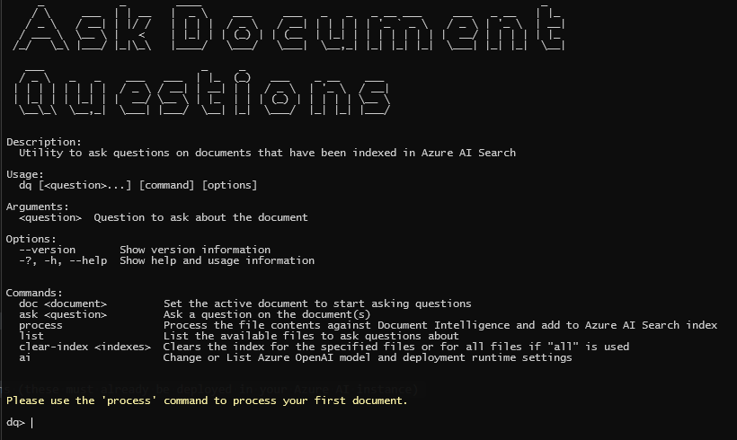

# Semantic Kernel and Azure OpenAI: Ask Questions on your document


## Overview

This solution provides an example of how to process your own documents and then use [Azure OpenAI](https://azure.microsoft.com/en-us/products/ai-services/openai-service) and [Semantic Kernel](https://learn.microsoft.com/en-us/semantic-kernel/overview/) to ask question specific to that document.

**NOTE**: In addition to the Azure Function deployment below, a console app is also provided to demonstrate how to use the OpenAI SDK to ask questions about the document using the same deployed AI services.


## What's Included

 This solution consists of C# function app which has 4 functions:

   1. `HttpTriggerUploadFile` - upload documents to an Azure Storage account via a REST Api
   2. `BlobTriggerProcessFile` - detects the uploaded document and processes it through [Azure Cognitive Services Document Intelligence](https://learn.microsoft.com/en-us/azure/ai-services/document-intelligence/overview?view=doc-intel-3.1.0) into one or more JSON files (depending on the size of the document)
   3. `HttpTriggerOpenAiSdkAskQuestion` - REST Api to ask questions about the document using the OpenAI SDK
   4. `HttpTriggerSemanticKernelAskQuestion` - REST Api to ask questions about the document using Semantic Kernel SDK

## Getting Started

### Prerequisites

Before deploying your solution, you will need access to an Azure OpenAI instance in the same subscription where you are going to deploy your solution and retrieve its `Endpoint` and a `Key`

### Deploying

Deployment is automated using PowerShell, the [Azure CLI](https://learn.microsoft.com/en-us/cli/azure/) and [Bicep](https://learn.microsoft.com/en-us/azure/azure-resource-manager/bicep/).\
To run the script, you will need to select an Azure location for deployment, the Azure Open AI endpoint and key and pick a name for the function (this must be a globally unique name and less than 10 characters).

*NOTE:* The template assumes you have both `gpt-4-32k` and `text-embedding-ada-002` models deployed to your Azure OpenAI instance. If you want to use a different model, change the `openAIChatModel` and `openAIEmbeddingModel` default parameter values in `./infra/functions.bicep` file. Be aware, that using a different GPT model may result in max token violations with the example below.

By default, the script will deploy an [Azure Cognitive Search](https://azure.microsoft.com/en-us/services/search/) instance and use it to store the results of the document processing and searching. If you do not want to deploy Azure Cognitive Search, you can use the `-useCognitiveSeach $false` parameter option to skip the deployment of Azure Cognitive Search and only use the `extracted` blob container to store the results of the document processing.

``` powershell
# obtain an Azure access token
az login

# deploy the solution
.\deploy.ps1 -functionAppName  <function name>  -openAiEndpoint <http endpoint value> -openAiKey <openai key> -location <azure location>
```

If successful, this process will create:

- Storage account with two blob containers (`raw` for uploaded documents and `extracted` for processed output)
- Application Insights instance
- Function app with 3 functions with system assigned managed identity
  - Role assigment for the function identity to access blob storage and call Azure OpenAI
- Azure Cognitive Services account with system assigned managed identity
  - Role assigment for Cognitive Services identity for read access to `raw` container and write access to `extracted` container
- Azure Cogitive Search account
- *In addition, it will configure, compile and start the demo console app.*
  

### Running Samples via Azure Functions

1. Upload a document using the `HttpTriggerUploadFile` REST API. 
For this example, download and use [US Declaration of Independence as a PDF file](https://uscode.house.gov/download/annualhistoricalarchives/pdf/OrganicLaws2006/decind.pdf)
2. Once the file i uploaded, the `BlobTriggerProcessFile` will automatically trigger, process it with Document Intelligence and create a new folder called `decind` in the `extracted` blob container and save 3 JSON files.

3. Ask questions using the `HttpTriggerSemanticKernelAskQuestion` function - this uses semantic config to only load max of 2 pages to reduce tokens provided to Azure OpenAI.

   Question:

      Return:

      ``` text
      The document was signed by fifty-six signers.
      ```

   Question:

   ``` json
      {
      "filename": "decind.pdf",
      "question": "summarize this document in two bulleted sentences"
      }
   ```

   Return:

   ``` text
   - The Declaration of Independence was unanimously agreed upon by thirteen united states of America on July 4, 1776, to express their decision to dissolve their political connection with Great Britain and become independent due to numerous abuses and usurpations by the king.
   - The fundamental principles of their new government would be based on the belief that all men are created equal with certain unalienable rights including life, liberty, and the pursuit of happiness, and if any government becomes destructive of these ends, it is the right of the people to alter or abolish it, and to institute a new government.
   ```

### Running Samples via Console App

If you used the `deploy.ps1` script, the console app will be compiled and started automatically. Otherwise, you can run the console app by opening the `DocumentQuestionsFunction.sln` in Visual Studio or VS Code and running the `DocumentQuestionsConsole` project.

1. Open the console app. If this is your first time running the app or the Functions, you will not have any documents processed and you will be prompted to upload a document with the `process` 

   

2. Upload a document using the `process` command

   

3. Set the current document using the `doc` command

   

4. Start ask questions!

   

   

### Other Console App Features

- `list` - list all the documents processed

   

- `ai list` - list the Azure OpenAI models configured for the app

      

- `ai set` - set the Azure OpenAI model to use for asking questions (these must already be deployed in your Azure AI instance)

   
### What's next?

Try uploading your own documents and start asking question
